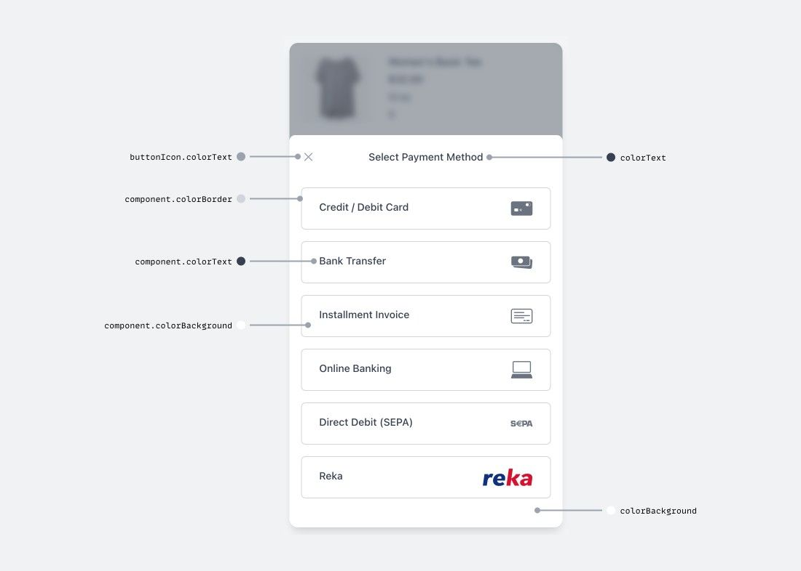
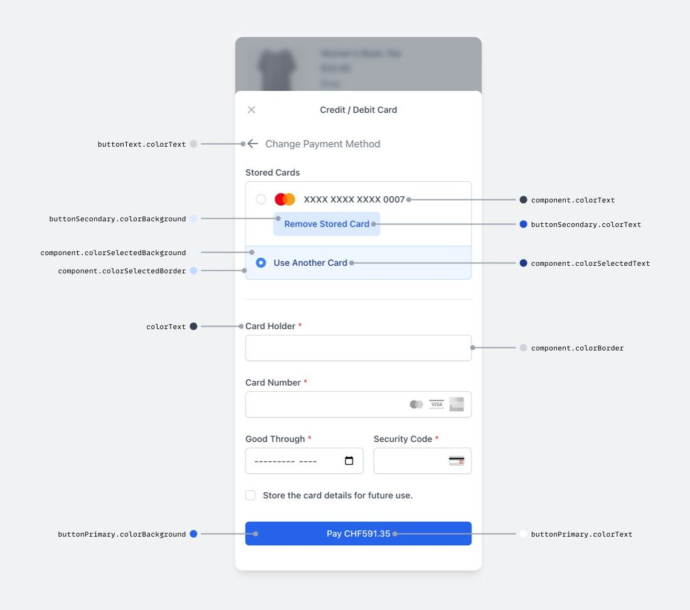
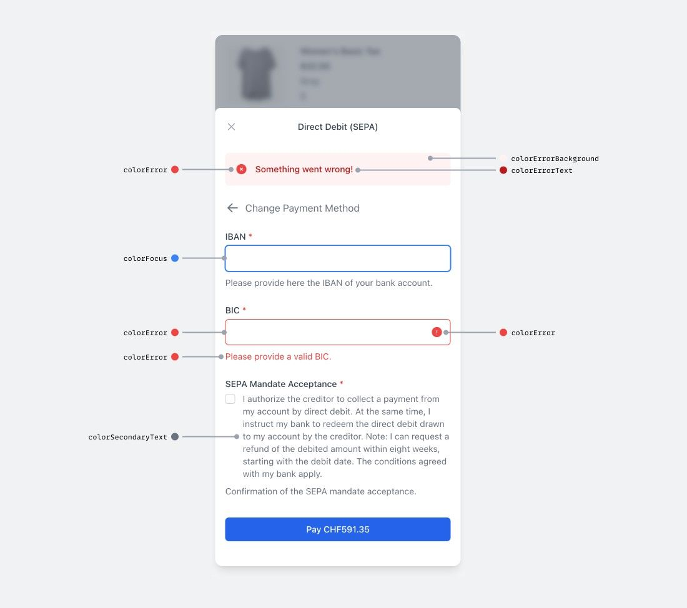

# Table of contents

- [Table of contents](#table-of-contents)
- [wallee Android Payment SDK](#wallee-android-payment-sdk)
  - [API reference](#api-reference)
  - [Installation](#installation)
    - [Requirements](#requirements)
    - [Configuration](#configuration)
  - [Integration](#integration)
    - [Set up wallee](#set-up-wallee)
    - [Create transaction](#create-transaction)
    - [Collect payment details](#collect-payment-details)
    - [Handle result](#handle-result)
    - [Verify payment](#verify-payment)
  - [Theming](#theming)
    - [Colors](#colors)
    - [Default themes](#default-themes)
      - [Light theme](#light-theme)
      - [Dark theme](#dark-theme)

# wallee Android Payment SDK

[](https://central.sonatype.com/artifact/com.wallee/wallee-payment-sdk/1.0.0)

## API reference

| API | Type | Description |
| --- | :-: | --- |
| `OnResultEventListener` | interface | Interface for handling post-payment events `paymentResult` |
| `fun paymentResult(paymentResult: PaymentResult)` | function | Result handler for transaction state |
| `WalleePaymentSdk(eventListener: OnResultEventListener, context: Context)` | constructor | Initialization of SDK. Both Parameters are required! |
| `walleePayment.launch(token: String)` | function | Opening payment dialog (activity) |
| `walleePayment.setDarkTheme(theme: JSONObject)` | function | Can override the whole dark theme or just some specific color. All colors are in json format |
| `walleePayment.setLightTheme(theme: JSONObject)` | function | Can override the whole light theme or just some specific color. All colors are in json format |
| `walleePayment.setCustomTheme(theme: JSONObject?, baseTheme: ThemeEnum)` | function | Force to use only this theme (independent on user's setup). Can override default light/dark theme and force to use it or completely replace all or specific colors |

## Installation

### Requirements

- Android 5.0 (API level 21) and above

### Configuration

Add `wallee-payment-sdk` to your `app/build.gradle` dependencies.

```groovy
dependencies {
    // ...
    implementation("com.wallee:wallee-payment-sdk:1.0.0")
    // ...
}
```

## Integration

### Set up wallee

To use the Android Payment SDK, you need a [wallee account](https://app-wallee.com/user/signup). After signing up, set up your space and enable the payment methods you would like to support.

### Create transaction

For security reasons, your app cannot create transactions and fetch access tokens. This has to be done on your server by talking to the [wallee Web Service API](https://app-wallee.com/en-us/doc/api/web-service). You can use one of the official SDK libraries to make these calls.

To use the Android Payment SDK to collect payments, an endpoint needs to be added on your server that creates a transaction by calling the [create transaction](https://app-wallee.com/doc/api/web-service#transaction-service--create) API endpoint. A transaction holds information about the customer and the line items and tracks charge attempts and the payment state.

Once the transaction has been created, your endpoint can fetch an access token by calling the [create transaction credentials](https://app-wallee.com/doc/api/web-service#transaction-service--create-transaction-credentials) API endpoint. The access token is returned and passed to the Android Payment SDK.

```bash
# Create a transaction
curl 'https://app-wallee.com/api/transaction/create?spaceId=1' \
  -X "POST" \
  -d "{{TRANSACTION_DATA}}"

# Fetch an access token for the created transaction
curl 'https://app-wallee.com/api/transaction/createTransactionCredentials?spaceId={{SPACE_ID}}&id={{TRANSACTION_ID}}' \
  -X 'POST'
```

### Collect payment details

Before launching the Android Payment SDK to collect the payment, your checkout page should show the total amount, the products that are being purchased and a checkout button to start the payment process.

Let your checkout activity extend `OnResultEventListener`, add the necessary function `paymentResult`.

```kotlin
import com.wallee.walleepaymentsdk.event.PaymentResult
import com.wallee.walleepaymentsdk.event.OnResultEventListener

class MainActivity : AppCompatActivity(), OnResultEventListener {
    override fun paymentResult(paymentResult: PaymentResult) {
        // Handle transaction result
    }
}
```

Initialize the `WalleePaymentSdk` instance inside `onCreate` of your checkout activity.

```kotlin
// ...
import com.wallee.walleepaymentsdk.WalleePaymentSdk

class MainActivity : AppCompatActivity(), OnResultEventListener {
    lateinit var walleePayment: WalleePaymentSdk

    override fun onCreate(savedInstanceState: Bundle?) {
        super.onCreate(savedInstanceState)
        setContentView(R.layout.activity_main)
        walleePayment = WalleePaymentSdk(this, this)
    }

    // ...
}
```

When the customer taps the checkout button, call your endpoint that creates the transaction and returns the access token, and launch the payment dialog.

```kotlin
// ...

class MainActivity : AppCompatActivity(), OnResultEventListener {
    lateinit var walleePayment: WalleePaymentSdk
    lateinit var btnCheckout: Button

    override fun onCreate(savedInstanceState: Bundle?) {
        super.onCreate(savedInstanceState)
        setContentView(R.layout.activity_main)
        walleePayment = WalleePaymentSdk(this,this)

        btnCheckout.setOnClickListener {
            // Call endpoint and get access token
            walleePayment.launch("ACCESS_TOKEN")
        }
    }

    // ...
}
```

After the customer completes the payment, the dialog dismisses and the `paymentResult` method is called.

### Handle result

The response object contains these properties:

- `code` describing the result's type.

  | Code        | Description                                                   |
  | ----------- | ------------------------------------------------------------- |
  | `COMPLETED` | The payment was successful.                                   |
  | `FAILED`    | The payment failed. Check the `message` for more information. |
  | `CANCELED`  | The customer canceled the payment.                            |

- `message` providing a localized error message that can be shown to the customer.

```kotlin
// ...
import com.wallee.walleepaymentsdk.event.PaymentResult

class MainActivity : AppCompatActivity(), OnResultEventListener {
    // ...

    override fun paymentResult(paymentResult: PaymentResult) {
        when (response.code) {
            ResponseSuccessEnum.COMPLETED -> print("... do something")
            ResponseSuccessEnum.FAILED -> print("... do something")
            ResponseSuccessEnum.CANCELED -> print("... do something")
        }
    }

    // ...
}
```

### Verify payment

As customers could quit the app or lose network connection before the result is handled or malicious clients could manipulate the response, it is strongly recommended to set up your server to listen for webhook events the get transactions' actual states. Find more information in the [webhook documentation](https://app-wallee.com/en-us/doc/webhooks).

## Theming

The appearance of the payment dialog can be customized to match the look and feel of your app. This can be done for both the light and dark theme individually.

Colors can be modified by passing a JSON object to the `WalleePaymentSdk` instance. You can either completely override the theme or only change certain colors.

- `walleePayment.setLightTheme(JSONObject)` allows to modify the payment dialog's light theme.
- `walleePayment.setDarkTheme(JSONObject)` allows to modify the payment dialog's dark theme.
- `walleePayment.setCustomTheme(JSONObject, ThemeEnum)` allows to enforce a specific theme (dark, light or your own).

```kotlin
// ...
import com.wallee.walleepaymentsdk.enums.ThemeEnum

class MainActivity : AppCompatActivity(), OnResultEventListener {
    // ...

    override fun onCreate(savedInstanceState: Bundle?) {
        super.onCreate(savedInstanceState)
        setContentView(R.layout.activity_main)
        walleePayment = WalleePaymentSdk(this,this)

        walleePayment.setDarkTheme(getCustomTheme())
        walleePayment.setLightTheme(getCustomTheme())
    }

    fun getCustomTheme(): JSONObject {
        val customTheme = JSONObject()
        customTheme.put("colorBackground", "#ABA2A2")
        customTheme.put("colorText", "#2F4858")
        customTheme.put("colorHeadingText", "#4F5769")
        customTheme.put("colorError", "#998D91")
        return customTheme
    }

    // ...
}
```

This will override the colors `colorBackground`, `colorText`, `colorHeadingText` and `colorError` for both the dark and light theme.

The `setCustomTheme` function allows to define the theme to be used by the payment dialog and prevent it from switching themes based on the user's settings. This way e.g. high- and low-contrast themes can be added. The logic for switching between these themes is up to you though.

```kotlin
// ...
import com.wallee.walleepaymentsdk.enums.ThemeEnum

class MainActivity : AppCompatActivity(), OnResultEventListener {
    // ...

    override fun onCreate(savedInstanceState: Bundle?) {
        super.onCreate(savedInstanceState)
        setContentView(R.layout.activity_main)
        walleePayment = WalleePaymentSdk(this,this)

        walleePayment.setCustomTheme(getCustomTheme(), ThemeEnum.DARK)
    }

    fun getCustomTheme(): JSONObject {
        val customTheme = JSONObject()
        customTheme.put("colorBackground", "#0800FC")
        customTheme.put("colorText", "#EA00B6")
        customTheme.put("colorHeadingText", "#FF0071")
        customTheme.put("colorError", "#FF693E")
        return customTheme
    }

    //...
}
```

You can also use `setCustomTheme` to force the usage of the light or dark theme.

```kotlin
  //...
walleePayment.setCustomTheme(null, ThemeEnum.DARK)
```

### Colors

  

### Default themes

#### Light theme

```json
{
  "colorPrimary": "#3b82f6",
  "colorBackground": "#ffffff",
  "colorText": "#374151",
  "colorSecondaryText": "#6b7280",
  "colorHeadingText": "#111827",
  "colorError": "#ef4444",
  "toast": {
    "border": "#F14D00",
    "background": "#FFF6F6",
    "messageText": "#ef4444"
  },
  "component": {
    "colorBackground": "#ffffff",
    "colorBorder": "#d1d5db",
    "colorText": "#374151",
    "colorPlaceholderText": "#4b5563",
    "colorFocus": "#3b82f6",
    "colorSelectedText": "#1e3a8a",
    "colorSelectedBackground": "#eff6ff",
    "colorSelectedBorder": "#bfdbfe",
    "colorDisabledBackground": "#80808019"
  },
  "buttonPrimary": {
    "colorBackground": "#2563eb",
    "colorText": "#ffffff",
    "colorHover": "#1d4ed8"
  },
  "buttonSecondary": {
    "colorBackground": "#bfdbfe",
    "colorText": "#1d4ed8",
    "colorHover": "#bfdbfe"
  },
  "buttonText": {
    "colorText": "#6b7280",
    "colorHover": "#374151"
  },
  "buttonIcon": {
    "colorText": "#9ca3af",
    "colorHover": "#6b7280"
  }
}
```

#### Dark theme

```json
{
  "colorPrimary": "#3b82f6",
  "colorBackground": "#1f2937",
  "colorText": "#e5e7eb",
  "colorSecondaryText": "#9ca3af",
  "colorHeadingText": "#f9fafb",
  "colorError": "#ef4444",
  "toast": {
    "border": "#F14D00",
    "background": "#222222",
    "messageText": "#ef4444"
  },
  "component": {
    "colorBackground": "#374151",
    "colorBorder": "#6b7280",
    "colorText": "#f3f4f6",
    "colorPlaceholderText": "#9ca3af",
    "colorFocus": "#3b82f6",
    "colorSelectedText": "#f3f4f6",
    "colorSelectedBackground": "#4b5563",
    "colorSelectedBorder": "#9ca3af",
    "colorDisabledBackground": "#9ca3af"
  },
  "buttonPrimary": {
    "colorBackground": "#2563eb",
    "colorText": "#ffffff",
    "colorHover": "#1d4ed8"
  },
  "buttonSecondary": {
    "colorBackground": "#6b7280",
    "colorText": "#f3f4f6",
    "colorHover": "#4b5563"
  },
  "buttonText": {
    "colorText": "#9ca3af",
    "colorHover": "#d1d5db"
  },
  "buttonIcon": {
    "colorText": "#d1d5db",
    "colorHover": "#f3f4f6"
  }
}
```

💀
